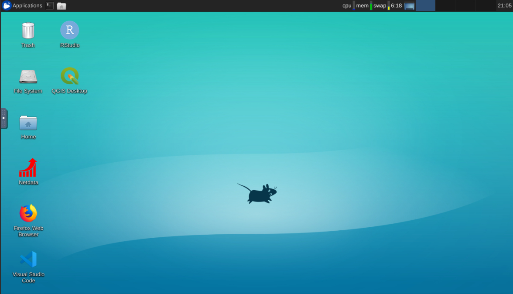
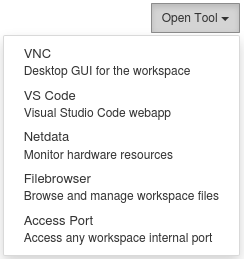
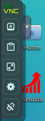
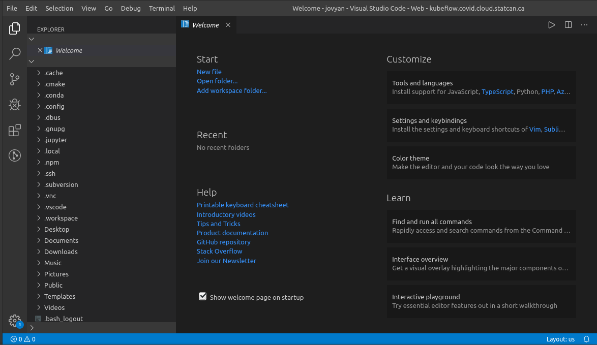
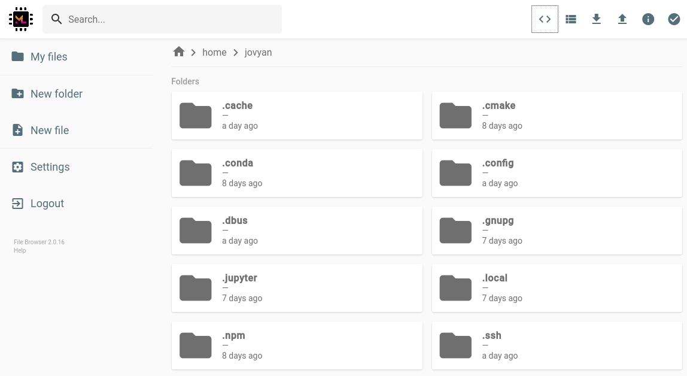
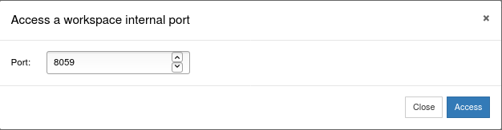
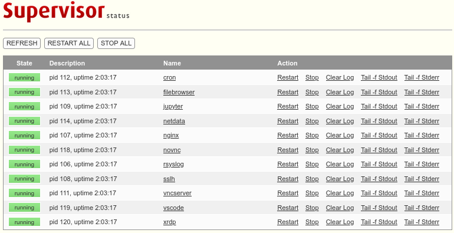

# Remote-Desktop

The Remote Desktop provides an in-browser GUI Ubuntu desktop experience as well as quick access to supporting tools.

Two versions of Remote Desktop are available. *R* includes R and RStudio. *Geomatics* extends *R* with QGIS and various supporting libraries. You may further customize your Remote Desktop workspace to suit your specific needs and preferences.

*pip*, *conda*, and *npm* are available to install various packages. Note: if your conda install stalls, try adding `--overide-channels -c [your channel of choice, e.g. conda-forge]`.

To launch the Remote Desktop or any of its supporting tools, create a Notebook Server in [Kubeflow](./Kubeflow.md) and select one of the available versions in the image dropdown. Then, connect and click on the *Open Tool* button in the top right corner.

*VNC* will bring you to the Desktop GUI. Click on the < on the left side of the screen to expand a panel with options such as fullscreen and clipboard access.

*VS Code* brings you to the Visual Studio Code IDE.

*Netdata* delivers in-depth interactive resource monitoring. Charts can be panned by dragging them. You can also zoom in and out with `SHIFT + mouse wheel`, or zoom to a selection by holding down `SHIFT` while dragging. 

*Filebrowser* can be used to quickly explore the file system of the Remote Desktop as well as to transfer files between the Remote Desktop and your computer.

Finally, *Access Port* provides in-browser access to anything served on a specified port inside the Remote Desktop (internally accessible at e.g. `localhost:8059`).

As with the other tools, this opens in a seperate page in your browser. Your namespace collaborators can also access this page if you send them the URL.

*Example: Accessing the Supervisor API at port 8059*

Remote Desktop is based on [ml-tooling/ml-workspace](https://github.com/ml-tooling/ml-workspace). 